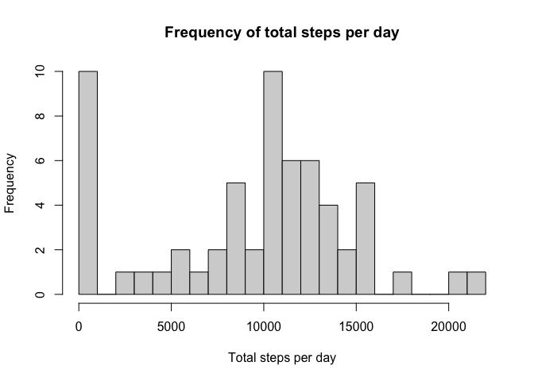
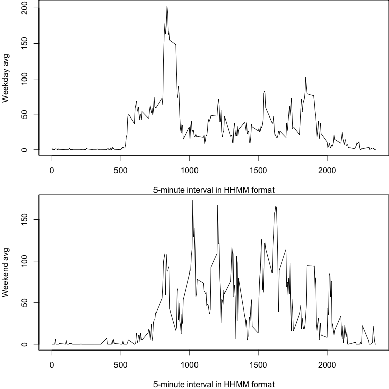

## Loading and preprocessing the data


```r
unzip("activity.zip")
rawData <- read.csv("activity.csv")
summary(rawData)
```

```
##      steps            date              interval     
##  Min.   :  0.00   Length:17568       Min.   :   0.0  
##  1st Qu.:  0.00   Class :character   1st Qu.: 588.8  
##  Median :  0.00   Mode  :character   Median :1177.5  
##  Mean   : 37.38                      Mean   :1177.5  
##  3rd Qu.: 12.00                      3rd Qu.:1766.2  
##  Max.   :806.00                      Max.   :2355.0  
##  NA's   :2304
```

## What is mean total number of steps taken per day?


```r
totalStepsPerDay <- rawData %>% group_by(date) %>%
  summarise(totalStepsPerDay=sum(steps, na.rm=TRUE), .groups="drop") %>%
  pull(totalStepsPerDay)
hist(totalStepsPerDay,
     xlab="Total steps per day",
     main="Frequency of total steps per day",
     breaks=20)
```

<!-- -->

```r
mean(totalStepsPerDay)
```

```
## [1] 9354.23
```

```r
median(totalStepsPerDay)
```

```
## [1] 10395
```

## What is the average daily activity pattern?


```r
dailyMeanSteps <- rawData %>% group_by(interval) %>%
  summarise(dailyMean=mean(steps, na.rm=TRUE), .groups="drop")
plot(
  dailyMeanSteps,
  type="l",
  xlab="5-minute interval in HHMM format",
  ylab="Average number of steps across all days")
```

<!-- -->

The 5-minute interval with the maximum average number of steps across all
the days in the dataset is 08:35-08:40 with 206 steps on average.


```r
dailyMeanSteps[which.max(dailyMeanSteps$dailyMean), ]
```

```
## # A tibble: 1 x 2
##   interval dailyMean
##      <int>     <dbl>
## 1      835      206.
```

## Imputing missing values

As in the above summary, the number of NAs is:

```r
length(rawData[is.na(rawData$steps), 1])
```

```
## [1] 2304
```

I am going to replace the missing values by `mean` over the same hour. If there
are no values at all to compute the mean, I will put 0 as the number of steps.


```r
data <- data.frame(rawData)
data$datetime <- as.POSIXct( # add standard datetime column
  paste(
    data$date,
    paste(
      as.character(data$interval %/% 100),
      as.character(data$interval %% 100),
      sep=":")))
data$hour <- format(data$datetime, "%Y-%m-%d %H") # add "mod hour" column
data <- merge( # add meanSteps column (over the same hour)
  data,
  data %>% group_by(hour=format(datetime, "%Y-%m-%d %H")) %>%
    summarise(meanSteps=mean(steps,na.rm=TRUE), .groups="drop"),
  by="hour")
# replace NA steps by meanSteps
data[is.na(data$steps), "steps"] <- data[is.na(data$steps), "meanSteps"]
# replace NaN steps (due to 0 non-NA steps within the same hour) by 0
data[is.nan(data$steps), "steps"] <- 0
data <- subset(data, select=-c(hour, meanSteps))
summary(data)
```

```
##      steps            date              interval     
##  Min.   :  0.00   Length:17568       Min.   :   0.0  
##  1st Qu.:  0.00   Class :character   1st Qu.: 588.8  
##  Median :  0.00   Mode  :character   Median :1177.5  
##  Mean   : 32.48                      Mean   :1177.5  
##  3rd Qu.:  0.00                      3rd Qu.:1766.2  
##  Max.   :806.00                      Max.   :2355.0  
##     datetime                  
##  Min.   :2012-10-01 00:00:00  
##  1st Qu.:2012-10-16 05:58:45  
##  Median :2012-10-31 11:57:30  
##  Mean   :2012-10-31 11:30:49  
##  3rd Qu.:2012-11-15 17:56:15  
##  Max.   :2012-11-30 23:55:00
```

### The mean total number of steps taken per day after imputting missing values


```r
totalStepsPerDay2 <- data %>% group_by(date) %>%
  summarise(totalStepsPerDay2=sum(steps), .groups="drop") %>%
  pull(totalStepsPerDay2)
hist(totalStepsPerDay2,
     xlab="Total steps per day",
     main="Frequency of total steps per day",
     breaks=20)
```

<!-- -->

```r
mean(totalStepsPerDay2)
```

```
## [1] 9354.23
```

```r
median(totalStepsPerDay2)
```

```
## [1] 10395
```

In the end, given the strategy of replacing the NAs by means, there is no
significant impact on the total number of steps per day, their `mean` and
`median`.

## Are there differences in activity patterns between weekdays and weekends?


```r
data$dayFactor <- factor(
  weekdays(data$datetime, abbreviate=TRUE),
  levels=c("Mon", "Tue", "Wed", "Thu", "Fri", "Sam", "Sun"),
  labels=c("Weekday", "Weekday", "Weekday", "Weekday", "Weekday",
           "Weekend", "Weekend"))
par(mfrow=c(2, 1))
par(mar=c(4, 4, 0, 0))
plot(data %>% filter(dayFactor == "Weekday") %>%
       group_by(interval) %>%
       summarise(m=mean(steps), .groups="drop"),
     type="l",
     xlab="5-minute interval in HHMM format",
     ylab="Weekday avg")
plot(data %>% filter(dayFactor == "Weekend") %>%
       group_by(interval) %>%
       summarise(m=mean(steps), .groups="drop"),
     type="l",
     xlab="5-minute interval in HHMM format",
     ylab="Weekend avg")
```

<!-- -->
